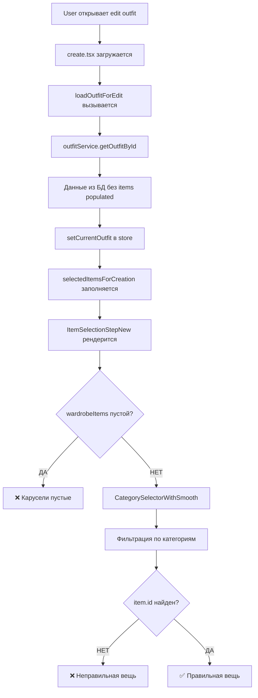
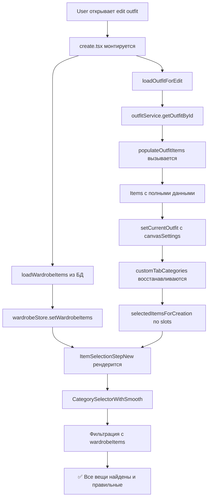

# 📊 АНАЛИЗ ПОТОКА ДАННЫХ В СИСТЕМЕ OUTFIT

**Дата:** 2025-11-09  
**Статус:** 🔴 Критические проблемы в data flow

## 🌊 ТЕКУЩИЙ ПОТОК ДАННЫХ (С ПРОБЛЕМАМИ)



## 🔴 ПРОБЛЕМНЫЕ ТОЧКИ

### 1. **Точка A-B: Инициализация**

```typescript
// ❌ ПРОБЛЕМА: wardrobeItems не загружаются при edit mode
useEffect(() => {
  if (isEditMode && id) {
    loadOutfitForEdit(id); // ✅ Outfit загружается
    // ❌ wardrobeItems НЕ загружаются!
  }
}, []);
```

### 2. **Точка D-E: Populate Items**

```typescript
// ❌ ПРОБЛЕМА: getOutfitById не делает populate
async getOutfitById(outfitId: string): Promise<Outfit> {
  const { data } = await supabase
    .from(this.tableName)
    .select('*')
    .eq('id', outfitId)
    .single();

  return this.mapDatabaseToOutfit(data);
  // ❌ НЕТ вызова populateOutfitItems!
}
```

### 3. **Точка E-F: Store Update**

```typescript
// ❌ ПРОБЛЕМА: customTabCategories не восстанавливаются
setCurrentOutfit: (outfit) => {
  const categories = get().customTabCategories; // ❌ Берет текущие, не из outfit
  // Должно быть:
  // const categories = outfit?.canvasSettings?.customTabCategories || DEFAULT;
};
```

### 4. **Точка H-I: AsyncStorage Conflict**

```typescript
// ❌ ПРОБЛЕМА: AsyncStorage перезаписывает данные из БД
useEffect(() => {
  const loadConfig = async () => {
    const config = await loadCustomTabConfig();
    if (config.categories.length > 0) {
      updateCustomTab(config.categories, config.order);
      // ❌ Перезаписывает данные из outfit!
    }
  };
  loadConfig(); // Вызывается всегда, даже при edit
}, []);
```

## ✅ ИСПРАВЛЕННЫЙ ПОТОК ДАННЫХ



## 📝 ДЕТАЛЬНЫЕ ИЗМЕНЕНИЯ

### 1. **create.tsx - Загрузка wardrobeItems**

```typescript
// ДОБАВИТЬ в create.tsx
useEffect(() => {
  const loadWardrobeItems = async () => {
    if (!user?.id) return;

    console.log('📦 [create.tsx] Loading wardrobe items from DB...');
    const items = await itemService.getUserItems(user.id);

    console.log(`✅ [create.tsx] Loaded ${items.length} wardrobe items`);
    wardrobeStore.setWardrobeItems(items);
  };

  loadWardrobeItems();
}, [user?.id]);
```

### 2. **outfitService.ts - Populate в getOutfitById**

```typescript
async getOutfitById(outfitId: string): Promise<Outfit> {
  console.log('📥 [outfitService] Getting outfit by ID:', outfitId);

  const { data, error } = await supabase
    .from(this.tableName)
    .select('*')
    .eq('id', outfitId)
    .single();

  if (error) throw error;

  const outfit = this.mapDatabaseToOutfit(data);

  // ✅ ДОБАВИТЬ populate!
  const [populatedOutfit] = await this.populateOutfitItems([outfit]);

  console.log('✅ [outfitService] Outfit populated with items');
  return populatedOutfit;
}
```

### 3. **outfitStore.ts - Восстановление customTabCategories**

```typescript
setCurrentOutfit: (outfit) => {
  // ✅ ВОССТАНОВИТЬ из outfit или из items
  let customCategories: ItemCategory[];

  if (outfit?.canvasSettings?.customTabCategories) {
    // Приоритет 1: Из canvasSettings
    customCategories = outfit.canvasSettings.customTabCategories;
    console.log(
      '✅ [outfitStore] Using saved customTabCategories from canvasSettings:',
      customCategories,
    );
  } else if (outfit?.items && outfit.items.length > 0) {
    // Приоритет 2: Восстановить из items (backward compatibility)
    const sortedItems = [...outfit.items].sort((a, b) => a.slot - b.slot);
    customCategories = sortedItems.map((item) => item.category);
    console.log('🔄 [outfitStore] Reconstructed customTabCategories from items:', customCategories);
  } else {
    // Приоритет 3: Defaults
    customCategories = DEFAULT_CUSTOM_CATEGORIES;
    console.log('📝 [outfitStore] Using default customTabCategories');
  }

  // Создать массив selectedItems правильного размера
  const selectedItems: (WardrobeItem | null)[] = createEmptySelection(customCategories.length);

  if (outfit?.items) {
    const sortedItems = [...outfit.items].sort((a, b) => a.slot - b.slot);

    sortedItems.forEach((outfitItem) => {
      if (outfitItem.item && outfitItem.slot < selectedItems.length) {
        selectedItems[outfitItem.slot] = outfitItem.item;

        console.log(`📍 [outfitStore] Placed item at slot ${outfitItem.slot}:`, {
          itemId: outfitItem.item.id,
          itemTitle: outfitItem.item.title,
          category: customCategories[outfitItem.slot],
        });
      }
    });
  }

  set({
    currentOutfit: outfit,
    currentItems: outfit?.items || [],
    currentBackground: outfit?.background || defaultBackground,
    selectedItemsForCreation: selectedItems,
    customTabCategories: customCategories, // ✅ Восстановить!
    activeTab: customCategories.length === 3 ? 'basic' : 'custom', // Умный выбор таба
    canvasSettings: outfit?.canvasSettings || defaultCanvasSettings,
    error: null,
  });

  console.log('🔍 [outfitStore] setCurrentOutfit COMPLETE:', {
    outfitId: outfit?.id,
    itemsCount: outfit?.items?.length || 0,
    customCategoriesCount: customCategories.length,
    reconstructedFromItems: !outfit?.canvasSettings?.customTabCategories,
  });
};
```

### 4. **ItemSelectionStepNew.tsx - Условная загрузка AsyncStorage**

```typescript
useEffect(() => {
  // ✅ НЕ загружать из AsyncStorage при edit mode!
  if (isEditMode) {
    console.log('🚫 [ItemSelection] Skipping AsyncStorage load - edit mode');
    return;
  }

  const loadConfig = async () => {
    console.log('📂 [ItemSelection] Loading custom tab config from AsyncStorage');
    const config = await loadCustomTabConfig();

    if (config.categories.length > 0) {
      console.log('✅ [ItemSelection] Loaded custom config:', config.categories);
      updateCustomTab(config.categories, config.order);
    }
  };

  loadConfig();
}, [updateCustomTab, isEditMode]); // ✅ Добавить isEditMode в deps
```

## 🧪 ТЕСТОВЫЕ СЦЕНАРИИ

### Test 1: Создание нового outfit

```
1. Открыть Create Outfit
2. Выбрать вещи в Basic tab
3. Переключиться на Custom tab
4. Добавить accessories
5. Сохранить
✅ Ожидание: canvasSettings содержит customTabCategories
```

### Test 2: Редактирование outfit

```
1. Открыть существующий outfit
2. Проверить логи:
   - "Loading wardrobe items from DB"
   - "Using saved customTabCategories from canvasSettings"
   - "Placed item at slot X"
3. Проверить карусели
✅ Ожидание: Правильные вещи в правильных позициях
```

### Test 3: Backward compatibility

```
1. Открыть старый outfit без canvasSettings
2. Проверить логи:
   - "Reconstructed customTabCategories from items"
3. Проверить карусели
✅ Ожидание: Категории восстановлены из items
```

## 📊 МЕТРИКИ УСПЕХА

| Метрика                           | До исправлений | После исправлений      |
| --------------------------------- | -------------- | ---------------------- |
| **itemTitle отображается**        | ❌ undefined   | ✅ Правильное название |
| **wardrobeItems загружены**       | ❌ Нет         | ✅ Да                  |
| **customTabCategories сохранены** | ❌ Нет         | ✅ В canvasSettings    |
| **Конфликт AsyncStorage**         | ❌ Да          | ✅ Нет                 |
| **Backward compatibility**        | ❌ Нет         | ✅ Да                  |

## 🚀 IMPLEMENTATION CHECKLIST

- [ ] Добавить загрузку wardrobeItems в create.tsx
- [ ] Исправить populate в getOutfitById
- [ ] Восстановить customTabCategories в setCurrentOutfit
- [ ] Добавить сохранение canvasSettings в confirmItemSelection
- [ ] Отключить AsyncStorage при edit mode
- [ ] Добавить canvas_settings в createOutfit/updateOutfit
- [ ] Протестировать все сценарии
- [ ] Удалить избыточные логи после тестирования

---

**Приоритет:** 🔴 КРИТИЧЕСКИЙ  
**Время реализации:** 1-2 часа  
**Сложность:** Средняя  
**Риски:** Минимальные при правильной реализации
